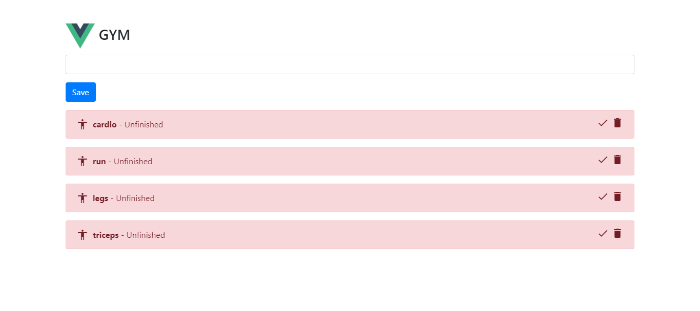
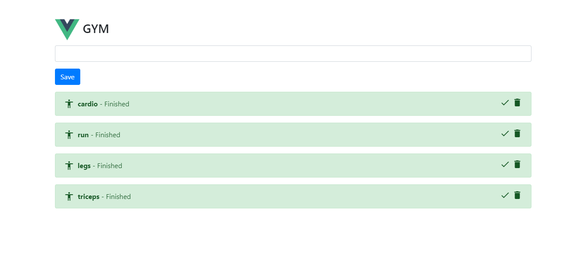
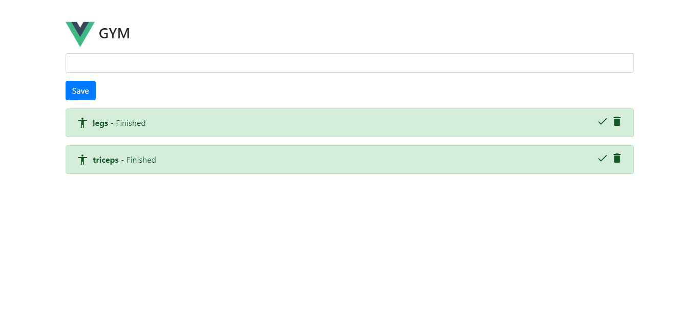

# To-Do-List-VanillaJs 

This is **to-do-List** with Vue  In this example I have done, I simulate the list of exercises for the gym where I am implementing **CRUD** operations using Local Storage as a Database

# Application Link

if you want look the app press here [App Link](https://josejavierpaez.github.io/To-Do-List-Vue/App/index)

# how does this work?

1. we write a exercise that we to do after, then press Save button, immediately the exercise going to show over there with status in false , it means that the action it's does not ready yet, and this looks like:
2. After we do the exercise we have to press the check mark, immediately the status will change to true, its means that the exercise has already done, and this looks like: 
3. If you want, you can press trash can icon to delete the exercise, and this looks like:
   
